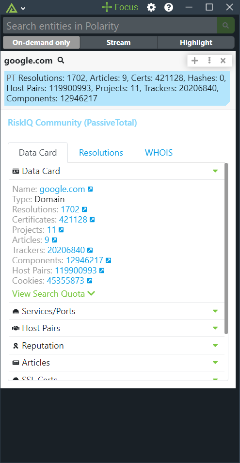
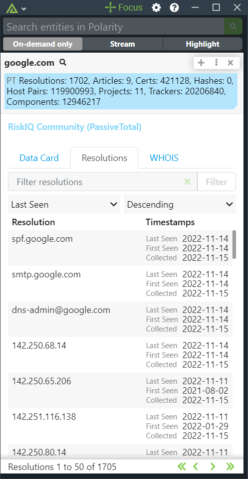
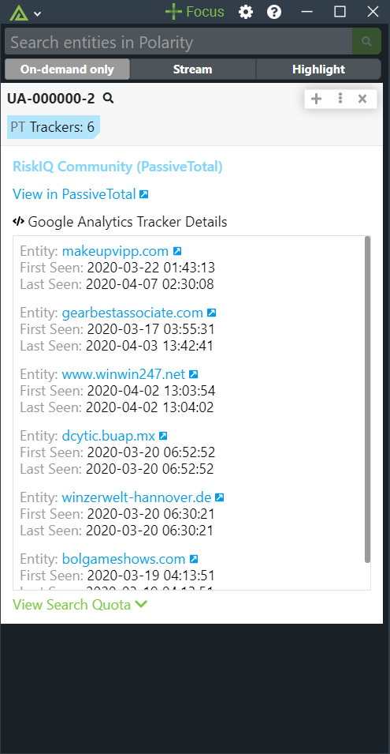
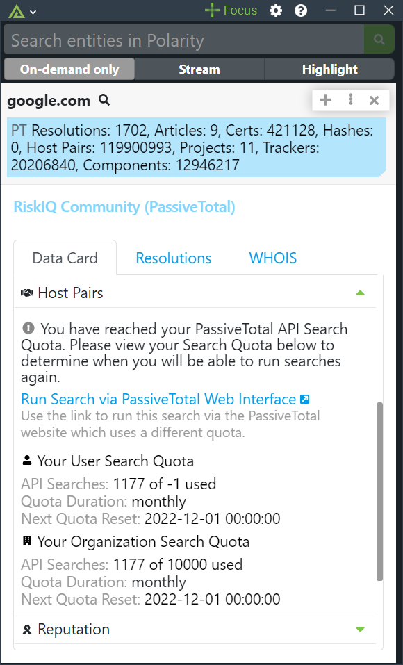
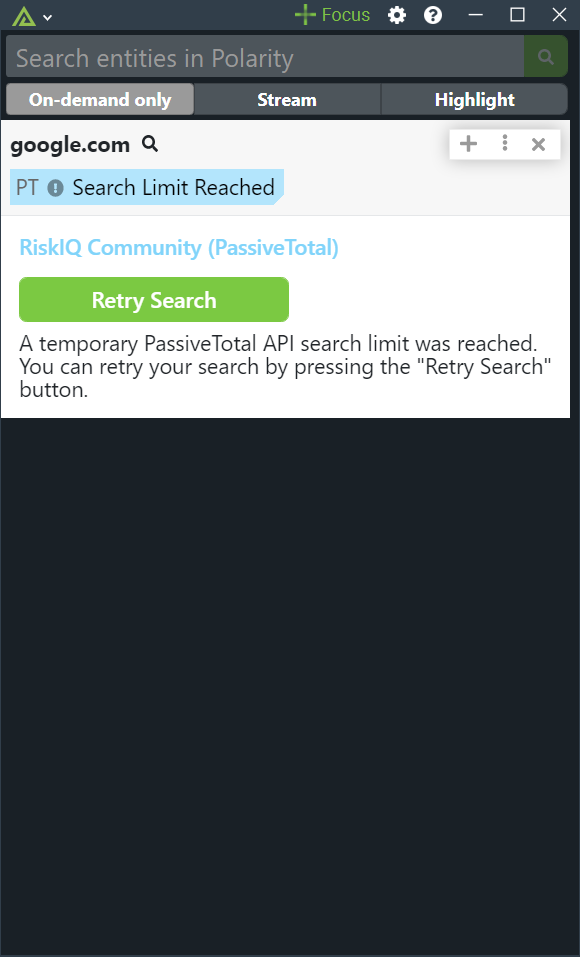

# Polarity RiskIQ Community (PassiveTotal) Integration

> As lookups return data on nearly every IPv4 address and domain, this integration is set to run in "On-Demand" mode only.

The Polarity RiskIQ Community (PassiveTotal) integration retrieves the "Data Summary Card" for both IPv4 addresses and domains. The integration can also perform additional lookups against malware and open source intelligence endpoints via the details view.  

Furthermore, the integration will also recognize Google Tracker ID's (i.e. UA-XXXXXX-X) and return a list of associated entities that have the identified tracker present.

To learn more about RiskIQ Community (PassiveTotal), please visit the [official website](https://community.riskiq.com/).

Check out the integration in action:

|  |  |  |
|---|--|--|
|*PassiveTotal Domain Lookup* | *Resolutions* |*PassiveTotal Google Tracker lookup* |

## RiskIQ Community (PassiveTotal) Requests

| Entity Type | REST API Endpoints Searched |
|------------|-----------------------------|
| IPv4 and Domain | https://api.passivetotal.org/v2/cards/summary   https://api.passivetotal.org/v2/enrichment/malware (on details)   https://api.passivetotal.org/v2/enrichment/osint (on details)|
| Google Tracker ID's | https://api.passivetotal.org/v2/trackers/search |

## RiskIQ Community (PassiveTotal) Integration Options

### RiskIQ Community (PassiveTotal) API URL
The URL of the RiskIQ Community (PassiveTotal) API including the schema (i.e., https://). Default is set to:  https://api.passivetotal.org

### RiskIQ Community (PassiveTotal) Api Username
PassiveTotal Username, used to access the API.

### RiskIQ Community (PassiveTotal) ApiKey
PassiveTotal API Key

### Enabled Datasources

Select which datasources are enabled. Certain datasources require an enterprise key. This option should be set to "Users can view only"

### Maximum Number of Associated Records to Return

Maximum number of Malware, Host Pairs, and OSINT results to return in the Polarity Overlay. Please note the higher the number to longer it will take for the query to return.  Defaults to 100.

### Ignore List
List of domains that you never want to send to PassiveTotal.

### Ignore Domain Regex
Domains that match the given regex will not be looked up.

### Ignore IP Regex
IPs that match the given regex will not be looked up.

### Max Concurrent Search Requests

Maximum number of concurrent search requests (defaults to 10). Integration must be restarted after changing this option.

### Minimum Time Between Searches

Minimum amount of time in milliseconds between each entity search (defaults to 50). Integration must be restarted after changing this option.

## PassiveTotal OSINT Searches

### Data Card

Returns a count of available data for various OSINT sources including a link to view the data in PassiveTotal. The Data Card also includes a drop down to view your current PassiveTotal API Search Quota based on the provide API key option.

### Services/Ports

Allows you to see services on recently open ports for an IP Address.

### OSINT

Searches open source intelligences sources

### Subdomains

Returns subdomains of the given domain 

### Articles

The integration will use the article search endpoint to search for articles associated with the given indicator.  Note that articles are only returned if the entity in question is listed as an indicator in the article.  As a result, the Articles tab can return no results even if the Data Card view shows a non-zero Article count.

### SSL Certificates

The integration searches certificates' `subjectCommonName` field for the given entity and returns any results.  As only a single field is searched, it is possible for no certificate results to be returned even if the "Data Card" views show hits.

### Reputation

This tab will be displayed if the "Enable Reputation Lookup" option is enabled

### Host Pairs

This tab will be displayed if the "Enable Host Pairs" option is enabled.  The tab will display matches on both the child and parent fields.  

### Malware

This tab will display any associated Malware.  

### WHOIS

This tab will display WHOIS information for the entity.

### Resolutions

This tab will display Passive DNS information for the given  IP or domain.

## API Limits, Timeouts, and Temporary Outages

### API Limits 

If you reach your PassiveTotal API Search Quota you will see a message informing you your quota has been reached.

|  |  |
|---|--|
|*PassiveTotal search quota exceeded while running a new lookup* | *PassiveTotal search quota exceeded while reviewing OSINT data via tabs* |

### Timeouts

The Polarity Server requires that APIs respond within 30 seconds.

The PassiveTotal API can sometimes take longer than this to respond to a request.  When this happens you will see a timeout message and be given the option to rerun the search.  The timeout message will also provide a link to run the search from the PassiveTotal web search interface.

|  |
|---|
|*PassiveTotal API timeout* | 

### Temporary Outages

Sometimes the PassiveTotal API will be temporarily unavailable due to PassiveTotal search restrictions.  When this occurs you will be given the ability to retry the search.

|  |  |
|---|--|
|*PassiveTotal temporary outage while running a new lookup* | *PassiveTotal temporary outage while reviewing OSINT data via tabs* |

## Installation Instructions

Installation instructions for integrations are provided on the [PolarityIO GitHub Page](https://polarityio.github.io/).

## Polarity

Polarity is a memory-augmentation platform that improves and accelerates analyst decision making.  For more information about the Polarity platform please see:

https://polarity.io/
